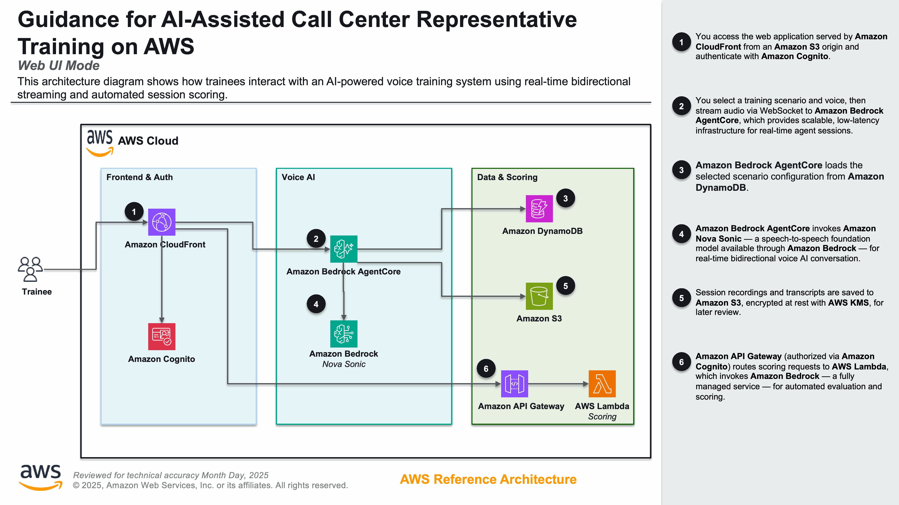
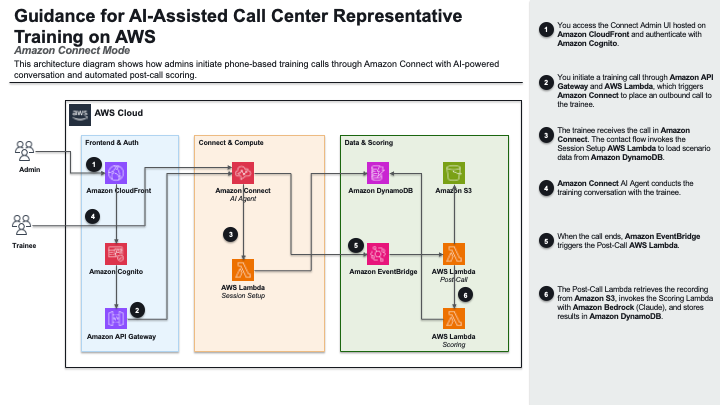

# Guidance for AI-Assisted Call Center Agent Training on AWS

## Table of Contents

1. [Overview](#overview)
    - [Cost](#cost)
2. [Prerequisites](#prerequisites)
    - [Operating System](#operating-system)
    - [Third-Party Tools](#third-party-tools)
    - [AWS Account Requirements](#aws-account-requirements)
    - [AWS CDK Bootstrap](#aws-cdk-bootstrap)
    - [Supported Regions](#supported-regions)
3. [Automated Deployment](#automated-deployment)
4. [Manual Deployment](#manual-deployment)
5. [Deployment Validation](#deployment-validation)
6. [Running the Guidance](#running-the-guidance)
7. [Next Steps](#next-steps)
8. [Cleanup](#cleanup)
9. [Notices](#notices)
10. [FAQ, Known Issues, Additional Considerations, and Limitations](#faq-known-issues-additional-considerations-and-limitations)
11. [Authors](#authors)

## Overview

This Guidance helps call center operations teams reduce agent onboarding time and improve training quality by providing AI-powered voice simulations of realistic customer interactions. An AI customer (powered by **Amazon Nova 2 Sonic**) engages trainees in real-time voice conversations based on configurable scenarios drawn from real call logs. Sessions are recorded in stereo WAV format with full transcripts and automatically scored against a detailed rubric using **Amazon Bedrock** (Claude).

Two deployment modes are supported:

- **Web UI** — Browser-based training via **Amazon CloudFront**, with **Amazon Cognito** authentication and role-based access (trainee/admin)
- **Amazon Connect** — Phone-based training where trainees call in and interact with the AI customer through **Amazon Connect** contact flows and AI Agents

Multilingual support covers English, French, Italian, German, Spanish, Portuguese, and Hindi via Nova 2 Sonic voices.

### Demo

[](https://youtu.be/uTJ_EdOM0H4)

### Architecture

#### Web UI



#### Amazon Connect



### Cost

_You are responsible for the cost of the AWS services used while running this Guidance. As of May 2026, the cost for running this Guidance with the default settings in the US East (N. Virginia) Region is approximately $350–$500 per month for processing 500 training sessions._

The following table provides a sample cost breakdown for deploying this Guidance with the default parameters in the US East (N. Virginia) Region for one month.

| AWS Service | Dimensions | Cost [USD] |
| --- | --- | --- |
| Amazon Bedrock (Nova 2 Sonic) | 500 sessions × 5 min avg bidirectional streaming | ~$150.00 |
| Amazon Bedrock (Claude) | 500 scoring invocations, ~4K tokens each | ~$15.00 |
| Amazon Bedrock AgentCore Runtime | 500 sessions, on-demand compute | ~$50.00 |
| AWS Lambda | 2,500 invocations (scoring, admin, trainee, empathy), 512MB–2GB, 10–60s | ~$5.00 |
| Amazon DynamoDB | 3 tables, on-demand, ~5GB storage, 10K reads/writes per month | ~$5.00 |
| Amazon S3 | 50GB recordings storage + requests | ~$2.00 |
| Amazon CloudFront | 100GB data transfer, 100K requests | ~$10.00 |
| Amazon Cognito | 100 active users (Plus plan with threat protection) | ~$15.00 |
| Amazon API Gateway | 10,000 HTTP API calls | ~$1.00 |
| Amazon VPC (NAT Gateway) | 1 NAT Gateway + data processing | ~$35.00 |
| VPC Endpoints (Interface) | 5 interface endpoints (Bedrock, ECR, CloudWatch, Secrets Manager, AgentCore) | ~$50.00 |
| AWS KMS | 2 keys + 10K requests | ~$2.00 |
| **Total** | | **~$340.00** |

**Additional costs for Amazon Connect mode:**

| AWS Service | Dimensions | Cost [USD] |
| --- | --- | --- |
| Amazon Connect | 500 voice minutes (inbound/outbound) | ~$50.00 |
| Amazon Connect AI Agent | 500 sessions | ~$25.00 |
| Amazon Lex | 500 sessions | ~$4.00 |
| Toll-free phone number | 1 number + per-minute charges | ~$5.00 |

_We recommend creating a [Budget](https://docs.aws.amazon.com/cost-management/latest/userguide/budgets-managing-costs.html) through [AWS Cost Explorer](https://aws.amazon.com/aws-cost-management/aws-cost-explorer/) to help manage costs. Prices are subject to change. For full details, refer to the pricing webpage for each AWS service used in this Guidance._

## Prerequisites

### Operating System

These deployment instructions are optimized to best work on **Amazon Linux 2023**. Deployment on macOS or other Linux distributions may require additional steps.

### Third-Party Tools

| Tool | Version | Install Command |
| --- | --- | --- |
| Python | 3.13+ | Pre-installed on Amazon Linux 2023 |
| Node.js | 18+ | `sudo dnf install nodejs` |
| npm | 9+ | Included with Node.js |
| AWS CDK CLI | 2.x | `npm install -g aws-cdk` |
| Docker | 20+ | `sudo dnf install docker && sudo systemctl start docker` |
| jq | 1.6+ | `sudo dnf install jq` |
| AWS CLI | 2.x | Pre-installed on Amazon Linux 2023 |

### AWS Account Requirements

- **Amazon Bedrock model access** — Enable the following models in your deployment region:
  - Amazon Nova 2 Sonic (`amazon.nova-2-sonic-v1:0`)
  - Anthropic Claude Sonnet 4 (`us.anthropic.claude-sonnet-4-6`)
  - Amazon Nova 2 Lite (`us.amazon.nova-2-lite-v1:0`)
- **Service quotas** — Default quotas are sufficient for most deployments. If running more than 10 concurrent training sessions, request an increase for Bedrock AgentCore Runtime concurrent invocations.
- **IAM permissions** — The deploying principal requires `AdministratorAccess` or equivalent permissions to create VPCs, Lambda functions, DynamoDB tables, S3 buckets, Cognito pools, CloudFront distributions, and Bedrock resources.

### AWS CDK Bootstrap

This Guidance uses AWS CDK. If you are using AWS CDK for the first time in your account/region, perform the following bootstrapping:

```bash
cd deployment
npm install
cdk bootstrap aws://ACCOUNT_ID/REGION
```

Replace `ACCOUNT_ID` with your AWS account ID and `REGION` with your target region (e.g., `us-east-1`).

### Supported Regions

This Guidance requires Amazon Bedrock AgentCore Runtime and Amazon Nova 2 Sonic, which are available in:

- US East (N. Virginia) — `us-east-1`
- US West (Oregon) — `us-west-2`

For Amazon Connect mode, the deployment region must also support Amazon Connect with AI Agents.

## Automated Deployment

A cross-platform deploy script automates all deployment steps including dependency verification, infrastructure creation, frontend builds, and asset deployment.

```bash
# Clone the repository
git clone <repository-url>
cd call-center-training-agent

# Install dependencies (required before first deployment)
cd deployment && npm install
cd ../frontend/app && npm install
cd ../../connect-admin/app && npm install
cd ../../

# Run the deploy script
./deployment/deploy.sh --webui

# Seed database with sample scenarios
python scripts/seed_scenarios.py
```

**Available deployment modes:**

| Flag | Description |
| --- | --- |
| `--webui` | Core infra + AgentCore runtime + Browser-based Web UI |
| `--connect` | Core infra + Amazon Connect integration |
| `--all` | Everything (Web UI + Amazon Connect) |
| `--agentcore` | Core infra + AgentCore runtime only (no UI) |

**What the script does:**

1. Verifies AWS CLI credentials and CDK prerequisites
2. Deploys the Core infrastructure stack (VPC, S3, DynamoDB, KMS)
3. Deploys the AgentCore Runtime stack (Docker image, IAM roles, Bedrock runtime)
4. Deploys the UI stack(s) with `skipFrontend=true` to create infrastructure first
5. Fetches stack outputs and generates frontend environment variables
6. Builds the React frontend(s) with production configuration
7. Syncs built assets to S3 and invalidates CloudFront cache

**Environment:**

- Designed for Amazon Linux 2023 (CodeBuild, EC2, or Cloud9)
- Also runs on macOS with Docker Desktop installed
- Requires AWS CLI configured with appropriate credentials

**Note:** For a detailed understanding of each deployment step, see the [Manual Deployment](#manual-deployment) section below.

## Manual Deployment

### Step 1: Clone the repository

```bash
git clone <repository-url>
cd call-center-training-agent
```

### Step 2: Install dependencies

```bash
# CDK infrastructure dependencies
cd deployment && npm install

# Frontend dependencies (for Web UI mode)
cd ../frontend/app && npm install

# Connect Admin UI dependencies (for Connect mode)
cd ../../connect-admin/app && npm install

cd ../../
```

### Step 3: Bootstrap CDK (first time only)

```bash
cd deployment
cdk bootstrap aws://ACCOUNT_ID/REGION
```

### Step 4: Deploy Core infrastructure stack

```bash
cd deployment
cdk deploy CallCenterTraining-Core --require-approval never --context deployMode=webui
```

This creates the VPC, S3 buckets, DynamoDB tables, KMS keys, and VPC endpoints.

### Step 5: Deploy AgentCore Runtime stack (Web UI mode)

```bash
cdk deploy CallCenterTraining-AgentRuntime --exclusively --require-approval never --context deployMode=webui
```

This builds the Docker image, creates the IAM role, and provisions the Bedrock AgentCore Runtime.

### Step 6: Deploy Web UI stack

```bash
cdk deploy CallCenterTraining-Web --exclusively --require-approval never --context deployMode=webui --context skipFrontend=true
```

### Step 7: Generate frontend environment variables

```bash
# Fetch stack outputs
WEB_OUTPUTS=$(aws cloudformation describe-stacks --stack-name "CallCenterTraining-Web" --output json)

# Extract values (requires jq)
USER_POOL_ID=$(echo "$WEB_OUTPUTS" | jq -r '.Stacks[0].Outputs[] | select(.OutputKey=="UserPoolId") | .OutputValue')
USERPOOL_CLIENT_ID=$(echo "$WEB_OUTPUTS" | jq -r '.Stacks[0].Outputs[] | select(.OutputKey=="UserPoolClientId") | .OutputValue')
IDENTITY_POOL_ID=$(echo "$WEB_OUTPUTS" | jq -r '.Stacks[0].Outputs[] | select(.OutputKey=="IdentityPoolId") | .OutputValue')
AGENT_RUNTIME_ARN=$(echo "$WEB_OUTPUTS" | jq -r '.Stacks[0].Outputs[] | select(.OutputKey=="AgentRuntimeArn") | .OutputValue')
API_GATEWAY_URL=$(echo "$WEB_OUTPUTS" | jq -r '.Stacks[0].Outputs[] | select(.OutputKey=="ApiGatewayUrl") | .OutputValue')
RECORDINGS_BUCKET=$(echo "$WEB_OUTPUTS" | jq -r '.Stacks[0].Outputs[] | select(.OutputKey=="RecordingsBucketName") | .OutputValue')
REGION=$(aws configure get region)

# Write environment file
cat > frontend/app/.env.production <<EOF
VITE_AWS_REGION=$REGION
VITE_USER_POOL_ID=$USER_POOL_ID
VITE_USER_POOL_CLIENT_ID=$USERPOOL_CLIENT_ID
VITE_IDENTITY_POOL_ID=$IDENTITY_POOL_ID
VITE_AGENT_RUNTIME_ARN=$AGENT_RUNTIME_ARN
VITE_API_URL=$API_GATEWAY_URL
VITE_RECORDINGS_BUCKET=$RECORDINGS_BUCKET
EOF
```

### Step 8: Build and deploy frontend assets

```bash
cd frontend/app
npm run build
cd ../../

# Get bucket name and distribution ID
FRONTEND_BUCKET=$(echo "$WEB_OUTPUTS" | jq -r '.Stacks[0].Outputs[] | select(.OutputKey=="FrontendBucketName") | .OutputValue')
DISTRIBUTION_ID=$(echo "$WEB_OUTPUTS" | jq -r '.Stacks[0].Outputs[] | select(.OutputKey=="DistributionId") | .OutputValue')

# Upload assets and invalidate cache
aws s3 sync frontend/app/dist "s3://${FRONTEND_BUCKET}/" --delete
aws cloudfront create-invalidation --distribution-id "$DISTRIBUTION_ID" --paths "/*"
```

### Step 9: Create an admin user

```bash
cd deployment
./create-user.sh admin@example.com YourPassword123! --group admin
```

### Step 10: Seed training scenarios

```bash
python scripts/seed_scenarios.py
```

## Deployment Validation

1. Open the **AWS CloudFormation** console and verify the following stacks show status `CREATE_COMPLETE`:
   - `CallCenterTraining-Core`
   - `CallCenterTraining-AgentRuntime` (Web UI mode)
   - `CallCenterTraining-Web` (Web UI mode)
   - `CallCenterTraining-Connect` (Connect mode)

2. Verify the CloudFront distribution is deployed:

   ```bash
   aws cloudformation describe-stacks --stack-name CallCenterTraining-Web \
     --query 'Stacks[0].Outputs[?OutputKey==`CloudFrontUrl`].OutputValue' --output text
   ```

   Open the returned URL in a browser. You should see the login page.

3. Verify the AgentCore Runtime is active:

   ```bash
   aws cloudformation describe-stacks --stack-name CallCenterTraining-AgentRuntime \
     --query 'Stacks[0].Outputs[?OutputKey==`AgentRuntimeArn`].OutputValue' --output text
   ```

4. Verify DynamoDB tables exist:

   ```bash
   aws dynamodb list-tables --query 'TableNames[?contains(@, `CallCenterTraining`)]'
   ```

## Running the Guidance

### Web UI Mode

**Required inputs:**
- Cognito user credentials (created via `create-user.sh`)
- Training scenario selection
- Microphone access in the browser

**Steps:**

1. Open the CloudFront URL in a browser (Chrome or Edge recommended for WebRTC support).
2. Log in with your Cognito credentials.
3. Select a training scenario from the scenario library. Choose a customer voice, mood level, and language.
4. Click **Start Session** — speak naturally via your microphone. The AI customer responds in real time.
5. Click **End Session** when the conversation is complete.
6. View the automated scoring results with detailed feedback across security, compliance, communication, and knowledge categories.

**Expected output:**

After ending a session, the scoring panel displays:
- Overall score (0–100)
- Category breakdowns with pass/fail indicators
- Specific feedback on areas for improvement
- Full transcript with timestamps

### Amazon Connect Mode

**Required inputs:**
- Admin UI credentials
- Trainee phone number
- Training scenario selection

**Steps:**

1. Open the Connect Admin UI URL in a browser and log in.
2. Select a training scenario and target trainee.
3. Click **Start Call** — Amazon Connect places an outbound call to the trainee.
4. The trainee answers and converses with the AI customer.
5. Post-call scoring runs automatically after the call ends.
6. Review results in the Admin UI dashboard.

## Next Steps

- **Customize scenarios** — Create new training scenarios in `scenarios/` based on your organization's call patterns. Each scenario includes customer context, key challenges, and success criteria.
- **Adjust scoring rubrics** — Modify scoring criteria via the Admin dashboard to align with your quality assurance standards.
- **Add languages** — Configure additional Nova 2 Sonic voices for new language support.
- **Integrate with existing LMS** — Use the API Gateway endpoints to pull session scores into your Learning Management System.
- **Scale for production** — Increase NAT Gateway count and VPC endpoint capacity for higher concurrent session loads. Consider adding a custom domain with ACM certificate for CloudFront.

## Cleanup

Destroy the deployed stacks:

```bash
cd deployment

# Destroy all stacks (reverse dependency order)
cdk destroy CallCenterTraining-Web --context deployMode=all --force
cdk destroy CallCenterTraining-Connect --context deployMode=all --force
cdk destroy CallCenterTraining-AgentRuntime --context deployMode=all --force
cdk destroy CallCenterTraining-Core --context deployMode=all --force
```

**Resources that require manual deletion:**

| Resource | Reason | Deletion Steps |
| --- | --- | --- |
| S3 buckets (recordings, scoring, access logs) | Buckets with objects cannot be auto-deleted | Empty via `aws s3 rm s3://BUCKET --recursive` then delete via console |
| KMS keys | Scheduled deletion with 7–30 day waiting period | `aws kms schedule-key-deletion --key-id KEY_ID --pending-window-in-days 7` |
| Cognito User Pool | Retained to prevent accidental user data loss | Delete via the Cognito console |
| DynamoDB tables (scenarios, sessions, criteria) | Retained to prevent data loss | Delete via the DynamoDB console |
| Toll-free phone numbers (Connect mode) | 30-day release quarantine | Release via Connect console → Channels → Phone numbers |

If you are removing the project entirely, also delete the CDK toolkit stack (`CDKToolkit`) if no other CDK projects use it in the same account/region.

## Notices

*Customers are responsible for making their own independent assessment of the information in this Guidance. This Guidance: (a) is for informational purposes only, (b) represents AWS current product offerings and practices, which are subject to change without notice, and (c) does not create any commitments or assurances from AWS and its affiliates, suppliers or licensors. AWS products or services are provided "as is" without warranties, representations, or conditions of any kind, whether express or implied. AWS responsibilities and liabilities to its customers are controlled by AWS agreements, and this Guidance is not part of, nor does it modify, any agreement between AWS and its customers.*

## FAQ, Known Issues, Additional Considerations, and Limitations

**Known Issues:**

- **Amazon Connect Lex integration toggle** — After the first deployment of the Connect stack, a one-time manual toggle is required in the Connect console to reconcile the Lex bot integration. See [docs/CONNECT_GUIDE.md](docs/CONNECT_GUIDE.md) for details.
- **Duo mode (multi-character scenarios)** — Supported only in Web UI mode. Amazon Connect AI Agents do not support multi-character handoffs.

**Additional Considerations:**

- This Guidance creates VPC interface endpoints that incur hourly charges regardless of usage. Consider disabling unused endpoints in `deployment/config.json` to reduce costs.
- The Cognito User Pool is configured with the Plus plan including threat protection. Downgrade to Essentials if advanced security features are not needed.
- Session recordings are stored unencrypted at rest in S3 with KMS server-side encryption. Access is restricted via IAM policies and bucket policies.
- All training data (scenarios, transcripts, scores) is synthetic or user-generated. No real customer data is used.

**Limitations:**

- Maximum concurrent sessions depend on Bedrock AgentCore Runtime quotas (default: 10 concurrent invocations).
- Nova 2 Sonic voice streaming requires a stable internet connection with low latency (<200ms RTT recommended).
- Screen recording analysis requires Chrome or Edge browsers with screen capture API support.

For any feedback, questions, or suggestions, please use the issues tab under this repo.

## Authors

- Mohammad Salehan
