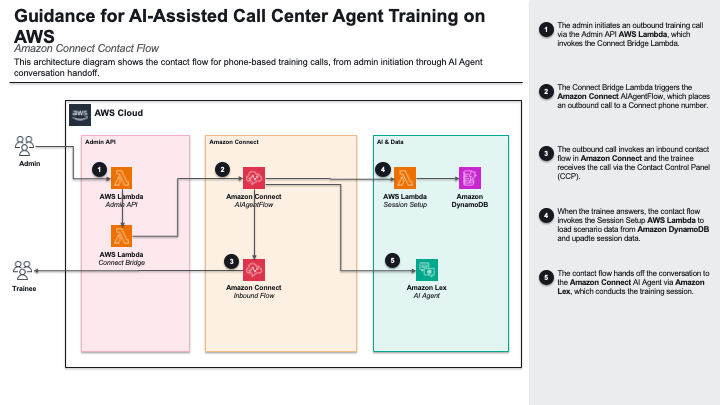

# Amazon Connect Integration - Setup & Deployment Guide

This stack now provisions nearly everything via CDK. What used to be a 15-step console procedure is reduced to a single `cdk deploy` plus a couple of post-deploy actions that cannot be fully automated.

## Architecture Overview


---

## Prerequisites

- AWS CLI configured with appropriate permissions
- Node.js 18+ and npm
- CDK CLI (`npm install -g aws-cdk`)
- Docker (for building Lambda containers)
- Python 3.12+ (for Lambda functions)
- AWS account with Amazon Connect service enabled in the target region

---

## What CDK Provisions

Deploying `CallCenterTraining-Connect` creates all of the following:

| Resource | CFN Type |
|---|---|
| Amazon Connect instance (inbound+outbound, Contact Lens, custom TTS) | `AWS::Connect::Instance` |
| KMS-encrypted recordings / Contact Lens / chat transcripts bucket | `AWS::S3::Bucket` + `AWS::KMS::Key` |
| Storage configs for CALL_RECORDINGS, SCHEDULED_REPORTS, CHAT_TRANSCRIPTS | `AWS::Connect::InstanceStorageConfig` |
| Wisdom (Q Connect) Assistant | `AWS::Wisdom::Assistant` |
| AI Prompt (ORCHESTRATION, MESSAGES format, published) | Custom resource → `qconnect:CreateAIPrompt` |
| AI Agent (ORCHESTRATION, published, wired to prompt version) | Custom resource → `qconnect:CreateAIAgent` |
| WISDOM_ASSISTANT integration association | `AWS::Connect::IntegrationAssociation` (via custom resource) |
| Lex V2 bot + version + alias + resource policy | `AWS::Lex::Bot` / `CfnBotVersion` / `CfnBotAlias` / `CfnResourcePolicy` |
| LEX_BOT integration association | `AWS::Connect::IntegrationAssociation` |
| LAMBDA_FUNCTION integration for Session Setup | `AWS::Connect::IntegrationAssociation` |
| Voice + Chat contact flows (ARN placeholders substituted at deploy time) | `AWS::Connect::ContactFlow` |
| Toll-free US phone number | `AWS::Connect::PhoneNumber` |
| Session Setup Lambda, Admin API Lambda, Post-Call Lambda | `AWS::Lambda::Function` (VPC) |
| Admin UI (CloudFront + S3 + Cognito user pool) | `AWS::CloudFront::Distribution` etc. |

The contact flow JSON in [amazon-connect/AIAgentFlow.json](../amazon-connect/AIAgentFlow.json) and [amazon-connect/AIAgentChatFlow.json](../amazon-connect/AIAgentChatFlow.json) uses `${WisdomAssistantArn}`, `${AIAgentVersionArn}`, `${LambdaArn}`, `${LexBotAliasArn}` placeholders that CloudFormation resolves via `Fn::Sub` at deploy time.

---

## Deployment Modes

| Mode | Stacks | Use case |
|------|-------|----------|
| `agentcore` | `AgentCoreStack` | Shared backend only |
| `webui` | `+WebUIStack` | Browser-based training |
| `connect` | `+ConnectStack` | Amazon Connect training |
| `all` | `+WebUIStack +ConnectStack` | Everything |

---

## Step 1: Configure `deployment/config.json`

```json
{
  "connect": {
    "manageInstance": true,
    "instanceAlias": "call-center-training",
    "features": {
      "lexBot": true,
      "aiAgent": true,
      "contactFlows": true,
      "phoneNumber": true,
      "agentUser": true
    }
  }
}
```

**`manageInstance`** — whether CDK owns the Connect instance itself:
- `true` (recommended for greenfield) — CDK creates a new Connect instance, recordings bucket, KMS key, and storage configs.
- `false` — attach to an existing, manually-created instance. See "Attaching to an existing Connect instance" below.

### Attaching to an existing Connect instance (`manageInstance: false`)

Use this when you already have a Connect instance you want to preserve (existing users, routing profiles, phone numbers, recording history).

Example config:
```json
{
  "connect": {
    "manageInstance": false,
    "instanceArn": "<CONNECT_INSTANCE_ARN>",
    "recordingsBucket": "<RECORDINGS_BUCKET_NAME>",
    "destinationPhoneNumber": "<E164_PHONE_NUMBER>",
    "features": {
      "lexBot": true,
      "aiAgent": true,
      "contactFlows": true,
      "phoneNumber": false,
      "agentUser": false
    }
  }
}
```

**What CDK creates inside your instance:**
- Wisdom (Q Connect) Assistant + AI Prompt + AI Agent
- WISDOM_ASSISTANT integration association
- Lex V2 bot + Live alias + LEX_BOT integration + resource policy
- Voice + chat contact flows (named `CallCenterTrainingVoice` / `CallCenterTrainingChat`)
- Session Setup Lambda + LAMBDA_FUNCTION integration
- Post-call processing pipeline (EventBridge → Lambda → scoring)
- Admin UI (CloudFront + Cognito) + Admin API Gateway

**What stays yours (never touched):**
- The Connect instance itself — users, queues, routing profiles, security profiles, phone numbers
- Your recordings bucket — only *read* by the post-call Lambda, never written or modified
- Any existing contact flows (new flows are added alongside, never overwritten)

**Caveats:**

> ⚠️ **WARNING — Existing Q Connect / Lex integrations will be DELETED.**
>
> Connect allows only **one** `WISDOM_ASSISTANT` and **one** `LEX_BOT` integration association per instance. If your instance already has either, CDK's setup Lambda will automatically delete the existing integration before creating its own. **Any Q in Connect assistant or Lex bot previously wired into this instance will be disconnected.**
>
> If you use Q Connect or Lex on this instance for anything else (e.g. another AI agent, a different workflow), do **not** enable `aiAgent` / `lexBot` features against that instance — deploy to a separate instance instead.

- **Recordings bucket access.** The post-call Lambda needs `s3:GetObject` on your bucket. CDK grants this on its own IAM role, but if your bucket has a restrictive bucket policy (deny-by-default), you may need to allow the Lambda's role ARN explicitly.
- **Phone number routing.** Set `features.phoneNumber: false` and provide `destinationPhoneNumber` — CDK will NOT reassociate your existing number's inbound contact flow. If calls to `destinationPhoneNumber` should route through a specific flow, configure that manually in the Connect console.
- **Representative users.** Set `features.agentUser: false` — your instance presumably already has CCP users. The trainee login you pass to the Admin UI must match an existing user on your instance.
- **First-use Lex reconciliation.** After the first CDK deploy against your existing instance, you'll likely need to perform the "Reconcile Lex Bot Management" step (see Step 3 below) even if your instance previously had Lex bots configured. CDK adds a new LEX_BOT integration that Connect needs to reconcile once before it'll accept calls.

**`features`** — per-resource toggles for incremental deploys. Enable all for a full deploy. If a deploy fails partway (e.g. Lex bot issue), flip the failing flag off to roll back cleanly to the last-known-good state, fix, and re-enable:

| Flag | What it enables |
|------|-----------------|
| `lexBot` | Lex V2 bot + alias + LEX_BOT integration + resource policy |
| `aiAgent` | Wisdom Assistant + custom-resource AI Prompt/Agent setup |
| `contactFlows` | Voice + chat contact flows (requires `lexBot` + `aiAgent`) |
| `phoneNumber` | Toll-free US number + inbound flow association |
| `agentUser` | CCP trainee (representative) user + Secrets Manager password |

---

## Step 2: Deploy

```bash
cd deployment
./deploy.sh --connect
```

For iterative redeploys of just the Connect stack (faster, avoids touching Core/Web):

```bash
cd deployment && npm run build && cdk deploy CallCenterTraining-Connect --exclusively --require-approval never --context deployMode=connect
```

Note the CloudFormation outputs:

| Output | Description |
|--------|-------------|
| `ConnectInstanceArn` | Connect instance ARN |
| `ConnectInstanceAlias` | Alias → CCP URL: `https://<alias>.my.connect.aws/ccp-v2/` |
| `ConnectPhoneNumber` | Toll-free number claimed for training calls |
| `ConnectContactFlowId` | Voice flow ID |
| `ConnectChatContactFlowId` | Chat flow ID |
| `AIAgentAssistantId` | Q Connect Assistant ID |
| `AIAgentPublishedVersionArn` | Published AI Agent version ARN |
| `LexBotAliasArn` | Lex V2 bot alias ARN |
| `ConnectAdminApiUrl` | Admin API Gateway endpoint |
| `ConnectAdminUiUrl` | CloudFront URL for the admin dashboard |

---

## Step 3: Reconcile Lex Bot Management (Manual)

After the first deploy, Connect's runtime rejects the Lex integration with `Invalid Bot Configuration: Amazon Lex could not access your Q In Connect Assistant` on the first training call. Even though CDK sets `BOT_MANAGEMENT=true` on the instance, an extra console-side reconciliation step is needed to wire the Lex service-linked role correctly. This is a **one-time** action per instance.

1. Open the Connect admin console for the deployed instance.
2. In the left navigation, click **Flows**.
3. Scroll to the **Amazon Lex** section, uncheck **Enable Lex Bot Management in Amazon Connect**, and click **Save changes**.
4. Re-check the same checkbox and click **Save changes** again.

After this, training calls will succeed without the bot-configuration error.

---

## Step 4: Verify Speech Model

Nova Sonic speech-to-speech is configured by CDK via `unifiedSpeechSettings` on the bot locale. Verify it's active:

1. Open the Connect console → **Flows** → **Conversational AI** tab.
2. Open the bot `call-center-training-agent-bot`.
3. Confirm **Model type** shows **Speech-to-speech** and **Voice provider** shows **Amazon Nova Sonic**.

If the speech model is not set, select **Speech-to-speech** + **Amazon Nova Sonic** and click **Build Language**.

---

## Step 5: Retrieve the CCP Trainee Password

CDK already created the Connect-native CCP representative user (default username `trainee`, configurable via `config.connect.agentUsername`). Retrieve its auto-generated password from Secrets Manager:

```bash
SECRET_ARN=$(aws cloudformation describe-stacks \
  --stack-name CallCenterTraining-Connect \
  --query "Stacks[0].Outputs[?OutputKey=='ConnectAgentPasswordSecretArn'].OutputValue" \
  --output text)

aws secretsmanager get-secret-value \
  --secret-id "$SECRET_ARN" \
  --query SecretString --output text
```

> The Connect Admin UI (CloudFront dashboard) uses its own separate Cognito user pool. See the Admin UI output `AdminUserPoolId` from the stack, or add a dedicated admin user via the AWS Cognito console. The repo's `deployment/create-user.sh` targets the Web UI stack's Cognito pool, not the Connect Admin UI pool.

---

## Step 6: Test

### Testing a Training Call

1. **Open CCP:**
   - Open the CCP URL from the `ConnectInstanceAlias` output: `https://<alias>.my.connect.aws/ccp-v2/`
   - Log in with your Connect representative user
   - Set status to **Available**

2. **Initiate call from Admin UI:**
   - Open the Admin UI URL (from CDK output `ConnectAdminUiUrl`)
   - Log in with the Cognito credentials (from Step 5)
   - Select a training scenario
   - Enter the Connect representative username (default: `trainee`)
   - Click **Start Training Call**

3. **Accept the call in CCP:**
   - The call should appear in CCP
   - Accept the incoming call
   - The AI customer should greet and begin the training scenario
   - Verify the AI customer responds via Nova Sonic voice

### Test Chat Flow (Optional)

In the Connect console go to **Channels** → **Test Chat**, select the deployed chat flow, click **Test Settings** and add contact attributes `{"scenario_id": "sample_unauthorized_child_01"}`, then click **Start Chat**.

---

## Tearing Down

```bash
cd deployment
cdk destroy CallCenterTraining-Connect --context deployMode=connect
```

> **Note**: The toll-free phone number has `RemovalPolicy.RETAIN` to avoid the 30-day quarantine on release. Clean it up manually via the Connect console if no longer needed. S3 buckets, KMS keys, and Cognito User Pools also have `RETAIN` — remove manually if needed.
